# Chromatopy

[](fairchemistry.github.io/chromatopy/)
[](https://github.com/FAIRChemistry/chromatopy/actions/workflows/run_tests.yaml)
[](https://badge.fury.io/py/chromatopy)

## ℹ️ Overview

`chromatopy` is a Python package which aims to streamline the data processing and analysis of chromatographic reaction data. It allows to process raw or pre-processed chromatographic data, enrich it with metadata such as reaction time, temperature, pH, and initial concentrations of reaction components. Finally, the peaks of interest can be aggregated, concentrations calculated, and the time-course data for each analyte transformed to EnzymeML data.

`chromatopy` is designed to work seamlessly with [OpenChrom](https://lablicate.com/platform/openchrom), enabling batch processing of proprietary chromatographic data. After processing in OpenChrom and exporting to an open file format, the data can be further analyzed in Jupyter Notebooks using `chromatopy`. This allows for the creation and application of calibration curves and the generation of EnzymeML files for subsequent data analysis.
For some output formats, `chromatopy` provides a direct interface to read in data. For more information on the supported file formats and data preparation to use the `chromatopy` workflow, refer to the [_Data Preparation_](supported_formats.md) section.

``` mermaid
graph LR
  AD[🧪 Analytical Instrument] --> A[📄 Vendor-Specific Files];
  style AD fill:transparent,stroke:#000,stroke-width:2px;
  A[📄 Proprietary File Format] -->|read| B{OpenChrom};
  style B stroke-width:4px
  subgraph Processing in OpenChrom
    B --> B1[Baseline Correction]
    B1 --> B2[Peak Detection]
    B2 --> B3[Peak Integration]
    B3 --> B
    style B1 stroke-dasharray: 5, 5
    style B2 stroke-dasharray: 5, 5
    style B3 stroke-dasharray: 5, 5

  end
  B -->|export| C[📄 Open File Format]
  AD -->C
  C -->|read| D{chromatopy};
    style D stroke-width:4px
  subgraph in Jupyter Notebook
    subgraph with chromatopy
      D --> E[Enrich Data with Metadata]
      E --> F[Create and Apply Calibration Curves]
      F --> D
      style E stroke-dasharray: 5, 5
      style F stroke-dasharray: 5, 5
    end
    D -->|convert| G[📄 EnzymeML time-course Data]
    G -.-> H[📊 Data Science and Insights]
    H -.-> G
    style H stroke-dasharray: 5, 5,fill:transparent
  end
  G -->|export| I[📄 EnzymeML File]

```



## ⭐ Key Features

- **🌱 Low friction data processing**   
Leave behind data processing in spreadsheet applications and directly start with data analysis based on raw data.
- **🧪 Enrich reaction data with metadata**  
Assign metadata like initial concentrations of reactants, temperature, pH, etc. to reaction data to yield modeling-ready data.
- **📈 Create and apply calibration curves**  
Create calibrators for your analytes and use them throughout your data analysis for seamless concentration calculation.
- **📂 FAIR data**  
Transform your data into EnzymeML format for subsequent analysis pipelines.

## 🛠️ Installation

Install `chromatopy` using `pip`:

```bash
pip install chromatopy # 🚧 not released yet
```

or from source:

```bash
pip install git+https://github.com/FAIRChemistry/chromatopy.git
```

For more information an examples, please refer to the [Documentation](fairchemistry.github.io/chromatopy/) section.
