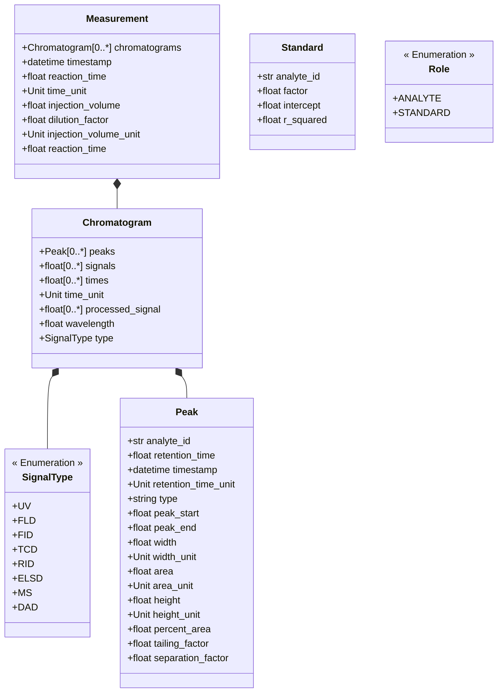

```mermaid
classDiagram
    Measurement *-- Chromatogram
    Chromatogram *-- SignalType
    Chromatogram *-- Peak
    
    class Measurement {
        +Chromatogram[0..*] chromatograms
        +datetime timestamp
        +float reaction_time
        +Unit time_unit
        +float injection_volume
        +float dilution_factor
        +Unit injection_volume_unit
        +float reaction_time
    }
    
    class Chromatogram {
        +Peak[0..*] peaks
        +float[0..*] signals
        +float[0..*] times
        +Unit time_unit
        +float[0..*] processed_signal
        +float wavelength
        +SignalType type
    }
    
    class Peak {
        +str analyte_id
        +float retention_time
        +datetime timestamp
        +Unit retention_time_unit
        +string type
        +float peak_start
        +float peak_end
        +float width
        +Unit width_unit
        +float area
        +Unit area_unit
        +float height
        +Unit height_unit
        +float percent_area
        +float tailing_factor
        +float separation_factor
    }
    
    class Standard {
        +str analyte_id
        +float factor
        +float intercept
        +float r_squared
    }
    
    class SignalType {
        << Enumeration >>
        +UV
        +FLD
        +FID
        +TCD
        +RID
        +ELSD
        +MS
        +DAD
    }
    
    class Role {
        << Enumeration >>
        +ANALYTE
        +STANDARD
    }
    
```