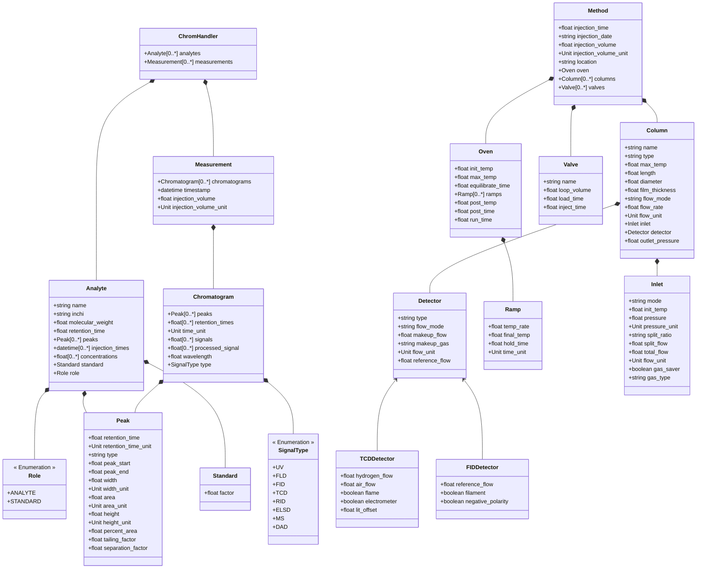

```mermaid
classDiagram
    Detector <-- TCDDetector
    Detector <-- FIDDetector
    ChromHandler *-- Analyte
    ChromHandler *-- Measurement
    Analyte *-- Role
    Analyte *-- Peak
    Analyte *-- Standard
    Measurement *-- Chromatogram
    Chromatogram *-- SignalType
    Chromatogram *-- Peak
    Method *-- Oven
    Method *-- Column
    Method *-- Valve
    Oven *-- Ramp
    Column *-- Inlet
    Column *-- Detector
    
    class ChromHandler {
        +Analyte[0..*] analytes
        +Measurement[0..*] measurements
    }
    
    class Analyte {
        +string name
        +string inchi
        +float molecular_weight
        +float retention_time
        +Peak[0..*] peaks
        +datetime[0..*] injection_times
        +float[0..*] concentrations
        +Standard standard
        +Role role
    }
    
    class Measurement {
        +Chromatogram[0..*] chromatograms
        +datetime timestamp
        +float injection_volume
        +Unit injection_volume_unit
    }
    
    class Chromatogram {
        +Peak[0..*] peaks
        +float[0..*] retention_times
        +Unit time_unit
        +float[0..*] signals
        +float[0..*] processed_signal
        +float wavelength
        +SignalType type
    }
    
    class Peak {
        +float retention_time
        +Unit retention_time_unit
        +string type
        +float peak_start
        +float peak_end
        +float width
        +Unit width_unit
        +float area
        +Unit area_unit
        +float height
        +Unit height_unit
        +float percent_area
        +float tailing_factor
        +float separation_factor
    }
    
    class Standard {
        +float factor
    }
    
    class Method {
        +float injection_time
        +string injection_date
        +float injection_volume
        +Unit injection_volume_unit
        +string location
        +Oven oven
        +Column[0..*] columns
        +Valve[0..*] valves
    }
    
    class Oven {
        +float init_temp
        +float max_temp
        +float equilibrate_time
        +Ramp[0..*] ramps
        +float post_temp
        +float post_time
        +float run_time
    }
    
    class Ramp {
        +float temp_rate
        +float final_temp
        +float hold_time
        +Unit time_unit
    }
    
    class Inlet {
        +string mode
        +float init_temp
        +float pressure
        +Unit pressure_unit
        +string split_ratio
        +float split_flow
        +float total_flow
        +Unit flow_unit
        +boolean gas_saver
        +string gas_type
    }
    
    class Column {
        +string name
        +string type
        +float max_temp
        +float length
        +float diameter
        +float film_thickness
        +string flow_mode
        +float flow_rate
        +Unit flow_unit
        +Inlet inlet
        +Detector detector
        +float outlet_pressure
    }
    
    class Detector {
        +string type
        +string flow_mode
        +float makeup_flow
        +string makeup_gas
        +Unit flow_unit
        +float reference_flow
    }
    
    class TCDDetector {
        +float hydrogen_flow
        +float air_flow
        +boolean flame
        +boolean electrometer
        +float lit_offset
    }
    
    class FIDDetector {
        +float reference_flow
        +boolean filament
        +boolean negative_polarity
    }
    
    class Valve {
        +string name
        +float loop_volume
        +float load_time
        +float inject_time
    }
    
    class SignalType {
        << Enumeration >>
        +UV
        +FLD
        +FID
        +TCD
        +RID
        +ELSD
        +MS
        +DAD
    }
    
    class Role {
        << Enumeration >>
        +ANALYTE
        +STANDARD
    }
    
```